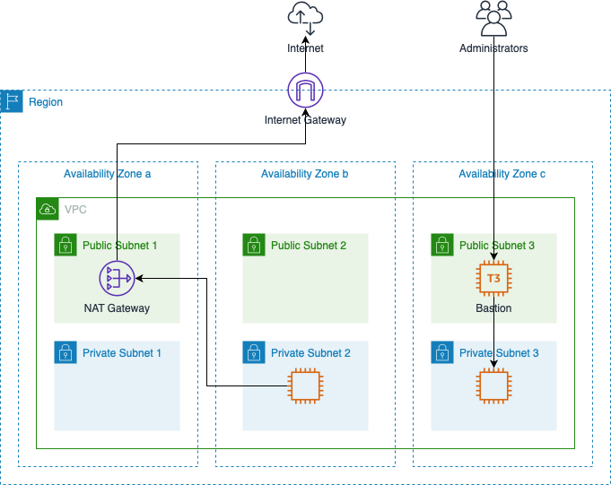

# Network Module

Create and configure a network in AWS.

## Layout

This figure displays a sample layout created by this module.

Given a VPC CIDR of 172.16.0.0/16 here is the address allocation:

| Item | CIDR |
| ---- | ---- |
| VPC | 172.16.0.0/16 |
| Public Subnet 1 | 172.16.0.0/20 |
| Public Subnet 2 | 172.16.16.0/20 |
| Public Subnet 3 | 172.16.32.0/20 |
| Unused | 172.16.48.0/20 |
| Private Subnet 1 | 172.16.64.0/18 |
| Private Subnet 2 | 172.16.128.0/18 |
| Private Subnet 3 | 172.16.192.0/18 |

## Description

Given a VPC CIDR and a list of availability zones, this module creates the
following:
1. VPC;
1. public and private subnets;
1. internet gateway;
1. NAT gateways;
1. route tables;
1. security groups; and
1. bastion hosts.

The following sub-sections describe these components in detail.

### VPC and Subnets

The module creates a VPC and public/private subnets in each availability zone.
The subnets are sized using the VPC CIDR and the number of availability zones
specified:

| Number of Availability Zones | Public Subnet Size (Fraction of VPC) | Private Subnet Size (Fraction of VPC) |
| ---------------------------- | ------------------------------------ | ------------------------------------- |
| 1 | 1/4 | 1/2 |
| 2,3 | 1/16 | 1/4 |
| 4,5,6 | 1/64 | 1/8 |

### Gateways and Routing Tables

The module creates 1 internet gateway and one or more NAT gateways. The routing
table for the public subnets directs outbound traffic to the internet gateway.
The routing tables for each private subnet direct outbound traffic to a NAT
gateway which in turn directs traffic to the internet gateway.

The default is to create one NAT gateway, but if a high level of traffic passes
through the gateway data transfer costs can be excessive. To alleviate this
more NAT gateways can be created to reduce traffic between availability zones.
The rule of thumb is one NAT gateway costs the same as 1.6 TB/month of data
transfer. For example, when traffic reaches 1.6 TB/month through the gateway
then it pays to add a second one. When traffic reaches 3.2 TB/month then a
third should be added. This continues until every availability zone has a NAT
gateway, at which point the intra-region traffic for NAT gateways is zero.

The module also creates an elastic IP for every NAT gateway. Since the public
IP address is often shared with outside organizations to permit access from
your VPC, it would be extremely disruptive if the public IP address were to
accidentally be lost. For this reason the elastic IPs for NAT gateways cannot
be deleted through Terraform. If you must destroy the resources created by this
module, then you must first remove the elastic IPs from the Terraform state and
then run `terraform destroy`:

    terraform state rm module.my-network.aws_eip.nat_gateways
    terraform destroy -target module.my-network

You can then release the elastic IPs manually in the AWS console. 

### Security Groups

The module creates 2 security groups:

| Security Group | Description |
| -------------- | ----------- |
| bastion | Defines SSH access to the public bastion servers. Access should only be granted to gateways used by admins. |
| internal | Defines access within the VPC. This group should be updated when a VPC peering connection is established. The security group also contains an egress rule for all protocols and all addresses. |

### Bastions

To limit ssh access to specific users the only public servers with port 22 open
are the bastion servers. These servers are brought up with an AWS key pair.
To restrict access this key should not be shared. Instead users who are granted
access must submit a public ssh key. This key will allow access to a `guest`
user on the bastions. Doing this allows administrators to grant and revoke
access to users independently.

A shared ssh key should be used for internal access. With this type of
configuration, the `~/.ssh/config` file can use the bastion as a proxy server.

For example suppose we define a VPC with the CIDR 172.16.0.0/16 and a bastion
host is created with a public IP address of 35.0.0.1. We want to use a personal
key file `my-key.pem` and a shared internal key of `shared-key.pem`. Finally,
assume all servers use Amazon Linux (which means the ssh user is `ec2-user`).
The following ssh config blocks would define proxy access:

    HostName bastion
        Host 35.0.0.1
        User guest
        IdentityFile ~/.ssh/my-key.pem
    
    HostName 172.16.*
        User ec2-user
        IdentityFile ~/.ssh/shared-key.pem
        ProxyCommand ssh -q bastion -W %h:%p

With this set up you can ssh _directly_ to any internal server with a single
command. For example if a web server had a private IP of 172.16.0.6, then you
would simply enter:

    ssh 172.16.0.6

This transparently authenticates you at the bastion and then tunnels through to
the web server. There are many other tricks you can play with the bastion such
as creating tunnels for other tools such as command line SQL clients or web
browsers with the ssh -L option. Or do full on SOCKS proxy with the FoxyProxy
plugin and the ssh -D option.
